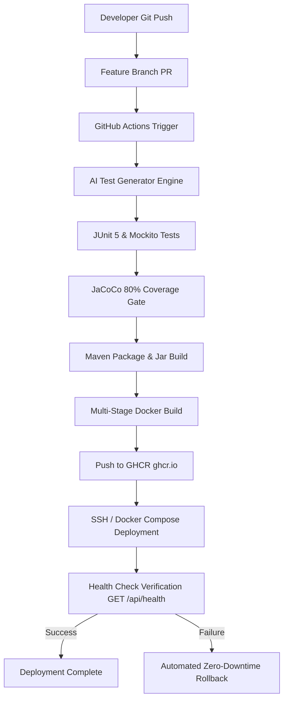

# AI-Powered GitHub CI/CD Workflow with Spring Boot (`ai-cicd-demo`)


An end-to-end, production-grade Spring Boot 3 demonstration repository implementing an **AI-Driven GitHub Actions CI/CD Pipeline**. 

When a developer opens or updates a Pull Request, an automated AI agent analyzes changed production Java code, generates comprehensive JUnit 5 tests, executes JaCoCo code coverage gates (minimum 80%), builds Docker container images, pushes to GitHub Container Registry (GHCR), and executes automated CD deployments with health check verification and zero-downtime rollback capabilities.

---

## 🏗️ Architecture Overview



---

## ⚡ Quick Start & Local Setup

### Prerequisites
- **Java 17+** (or Java 22)
- **Apache Maven 3.9+**
- **Docker & Docker Compose** (Optional for container testing)

### 1. Build and Run Tests Locally
```bash
# Set Java 17+ home environment variable (if required)
export JAVA_HOME="/path/to/jdk-17"

# Execute clean compilation, unit tests, and JaCoCo coverage gate check
mvn clean verify
```

JaCoCo HTML coverage reports are generated at:
```text
target/site/jacoco/index.html
```

### 2. Run Application Locally
```bash
# Run Spring Boot application locally with H2 in-memory profile
mvn spring-boot:run
```

Application endpoints will be available at `http://localhost:8080`.
OpenAPI Swagger UI is available at: `http://localhost:8080/swagger-ui.html`.

### 3. Run Application using Docker Compose
```bash
docker compose up --build -d
```

---

## 📡 API Usage & cURL Examples

### 1. Health Check (Public Endpoint)
```bash
curl -X GET http://localhost:8080/api/health
```
**Response (200 OK):**
```json
{
  "status": "UP"
}
```

### 2. User Registration
```bash
curl -X POST http://localhost:8080/api/auth/register \
  -H "Content-Type: application/json" \
  -d '{
    "name": "John Doe",
    "email": "john@example.com",
    "password": "Password@123"
  }'
```
**Response (201 Created):**
```json
{
  "id": 1,
  "name": "John Doe",
  "email": "john@example.com"
}
```

### 3. User Login
```bash
curl -X POST http://localhost:8080/api/auth/login \
  -H "Content-Type: application/json" \
  -d '{
    "email": "john@example.com",
    "password": "Password@123"
  }'
```
**Response (200 OK):**
```json
{
  "accessToken": "eyJhbGciOiJIUzI1NiJ9...",
  "tokenType": "Bearer"
}
```

### 4. Get Current Authenticated User (Protected Endpoint)
```bash
curl -X GET http://localhost:8080/api/users/me \
  -H "Authorization: Bearer <YOUR_JWT_ACCESS_TOKEN>"
```
**Response (200 OK):**
```json
{
  "id": 1,
  "name": "John Doe",
  "email": "john@example.com"
}
```

---

## 🤖 AI Test Generation Pipeline

The AI test generation subsystem resides under `.ai/`:

- **System Prompt Template**: `.ai/prompts/generate-junit-tests.md`
- **Automation Engine**: `.ai/scripts/generate_tests.py`

### How it Works:
1. When a PR is opened against `main`, `.github/workflows/ai-test-generation.yml` extracts the changed files between `origin/main...HEAD`.
2. Python script detects production Java classes (`src/main/java/`).
3. Sends code context to the configured AI API (`AI_PROVIDER`, `AI_API_KEY`, `AI_MODEL`).
4. Generates or updates JUnit 5 & Mockito test files under `src/test/java/`.
5. Compiles and executes `mvn test` and `mvn jacoco:report jacoco:check`.
6. Commits generated test files back to the PR branch using the commit message marker:
   `chore(ai): add generated junit tests`
7. Prevents infinite workflow loops by checking `head_commit.message`.

---

## 🔑 Required GitHub Secrets

To enable full AI test generation and CD deployment, configure the following secrets under **GitHub Repository Settings -> Secrets and variables -> Actions**:

| Secret Name | Required for | Description |
|---|---|---|
| `AI_API_KEY` | AI Test Gen | API key for OpenAI / GitHub Models / Azure OpenAI API. |
| `AI_PROVIDER` | AI Test Gen | Provider type: `openrouter`, `openai`, or `github-models` (Default: `openrouter`). |
| `AI_MODEL` | AI Test Gen | Target AI model name (Default: `qwen/qwen-2.5-coder-32b-instruct:free`). |
| `DEPLOY_HOST` | CD Pipeline | Target deployment VM IP address / hostname. |
| `DEPLOY_USER` | CD Pipeline | SSH username for deployment target server. |
| `DEPLOY_SSH_KEY` | CD Pipeline | Private SSH key for server access. |
| `DEPLOY_PORT` | CD Pipeline | Target SSH port (Default: `22`). |

---

## 🛡️ DevSecOps & Best Practices

- **Zero Hardcoded Credentials**: Database passwords, JWT secret keys, and API tokens are managed via environment variables and GitHub Action Secrets.
- **Non-Root Docker Containers**: `Dockerfile` creates and runs as `appuser:appgroup`.
- **Stateless JWT Security**: Passwords hashed with BCrypt, stateless SecurityFilterChain.
- **JaCoCo Quality Gate**: 80% line coverage ratio minimum required to pass CI.

---

## 📝 License
This project is open-source under the [MIT License](LICENSE).
