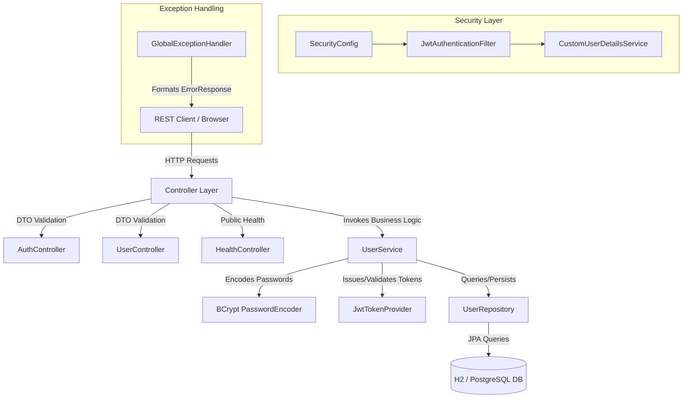
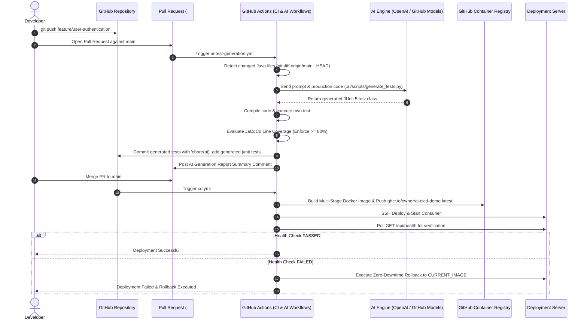

# System Architecture Specification (`ai-cicd-demo`)

This document outlines the detailed system architecture, CI/CD pipeline mechanics, AI test-generation workflow, security model, and automated deployment/rollback strategies for the `ai-cicd-demo` platform.

---

## 1. Application Layer Architecture

The Spring Boot backend follows a clean, strict layered architectural pattern separating concerns between Controllers, Services, Repositories, Domain Entities, and Security Filters.



---

## 2. CI/CD & AI Test Generation Pipeline

The CI/CD workflow is automated using GitHub Actions and an embedded AI Test Generator engine.



---

## 3. AI Test Generator Mechanics & Infinite Loop Prevention

To avoid recursive workflow triggers when AI commits generated tests back to the PR branch, the workflow evaluates commit markers and git diff boundaries.

```mermaid
flowchart TD
    A[Pull Request Event] --> B{Commit Message contains 'chore(ai): add generated junit tests'?}
    B -- YES --> C[Skip Workflow Trigger - Prevents Infinite Loop]
    B -- NO --> D[Checkout Branch & Run .ai/scripts/generate_tests.py]
    D --> E[Scan src/main/java for added/modified files]
    E --> F{AI_API_KEY Configured?}
    F -- YES --> G[Invoke Chat Completions API with System Prompt]
    F -- NO --> H[Generate Fallback JUnit 5 Structural Test Class]
    G --> I[Write Test Classes to src/test/java]
    H --> I
    I --> J[Run mvn test & JaCoCo 80% Check]
    J --> K{git status --porcelain src/test/java has changes?}
    K -- YES --> L[Git Commit & Push with 'chore(ai)' marker]
    K -- NO --> M[Complete Workflow without Commit]
```

---

## 4. Docker Container Architecture

The application is containerized using a multi-stage `Dockerfile` to produce minimal, secure runtime images.

```text
+-------------------------------------------------------------------+
| Stage 1: Builder (maven:3.9-eclipse-temurin-17-alpine)             |
|  - Copies pom.xml & resolves dependencies                         |
|  - Compiles source code & packages ai-cicd-demo.jar               |
+-------------------------------------------------------------------+
                                 |
                                 v (Copies built app.jar artifact)
+-------------------------------------------------------------------+
| Stage 2: Runtime (eclipse-temurin:17-jre-alpine)                  |
|  - Creates non-root system group appgroup & user appuser           |
|  - Sets file ownership chown appuser:appgroup /app                |
|  - Configures HEALTHCHECK: GET http://localhost:8080/api/health   |
|  - USER appuser                                                   |
|  - ENTRYPOINT ["java", "-jar", "app.jar"]                         |
+-------------------------------------------------------------------+
```

---

## 5. Deployment & Automated Rollback Strategy

The CD workflow (`.github/workflows/cd.yml`) uses an automated health verification loop to guarantee service availability.

1. **Pre-deployment capture**: Queries container inspection to record `CURRENT_IMAGE` ID.
2. **Container replacement**: Pulls `NEW_IMAGE` from `ghcr.io`, stops and removes the old container instance, and launches the new image.
3. **Health verification loop**: Polls `GET http://localhost:8080/api/health` up to 10 attempts (with 3s delay).
4. **Automated Rollback**: If HTTP status `200` is not received within 10 attempts, the deployment script immediately stops the failed container and redeploys `CURRENT_IMAGE`.

---

## 6. Coverage Strategy & Quality Gates

Code coverage is monitored and enforced by **JaCoCo Maven Plugin** during build execution:

- **Target Metric**: Line Coverage Ratio (`COVEREDRATIO`)
- **Threshold Limit**: Minimum 80% (`0.80`)
- **Exclusion Filters**: Data Transfer Objects (`com/example/aicicddemo/dto/**`), JPA Entities (`com/example/aicicddemo/entity/**`), and OpenAPI Configurations (`com/example/aicicddemo/config/**`).
- **Enforcement Action**: If line coverage falls below `0.80`, `mvn jacoco:check` throws a build error, breaking the CI pipeline and preventing deployment.
